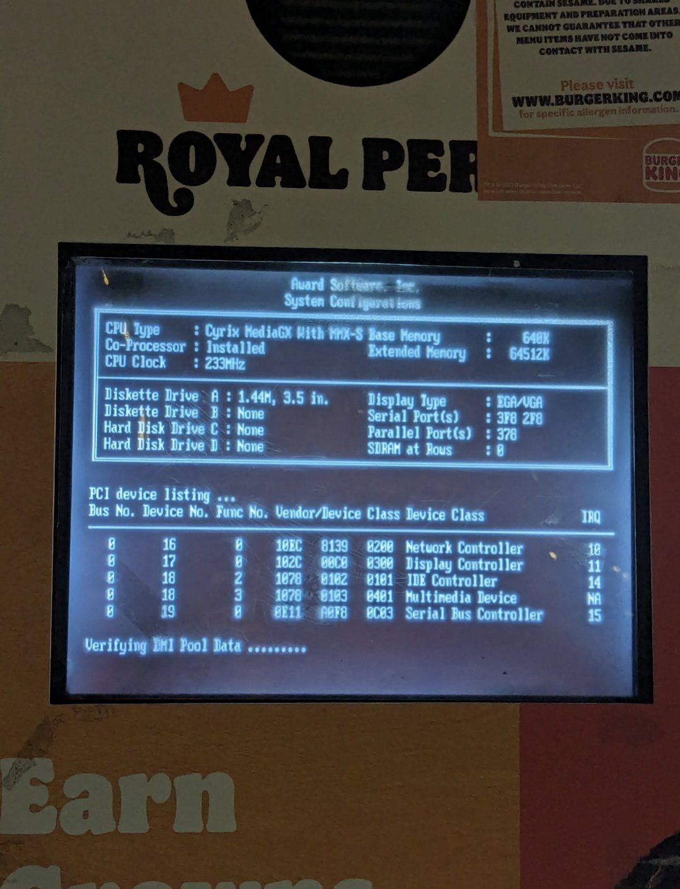
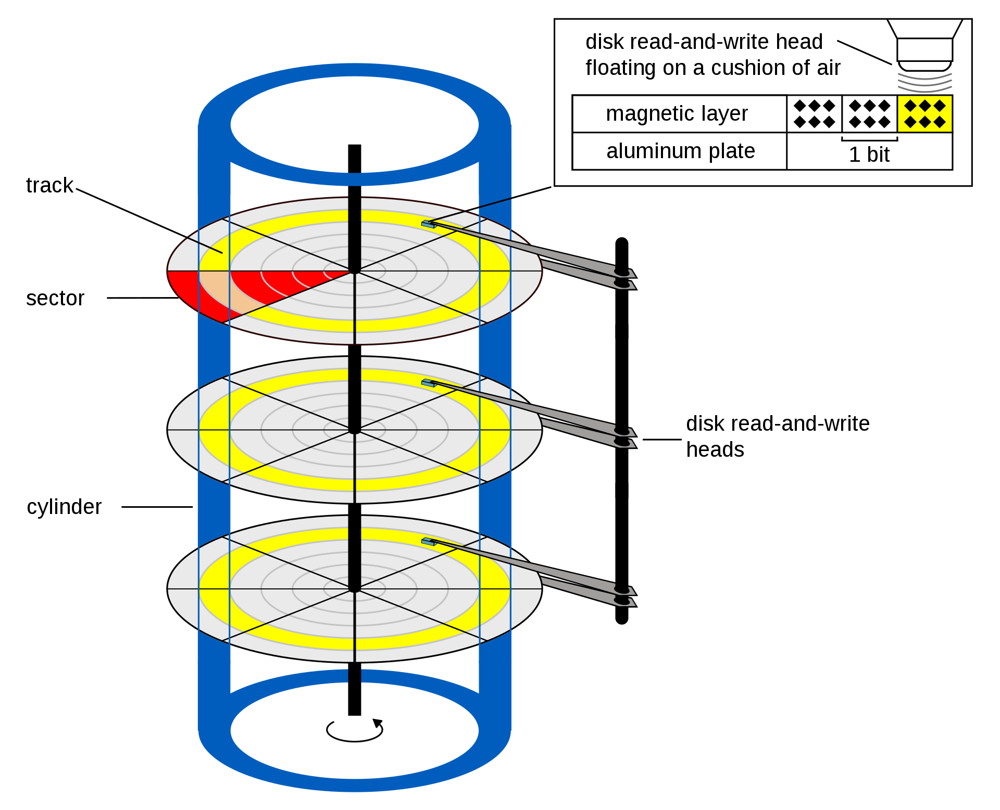
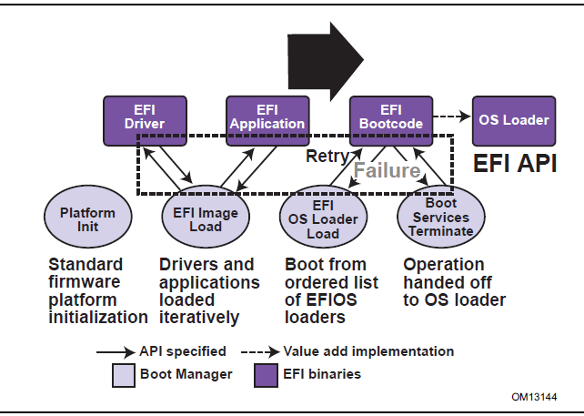
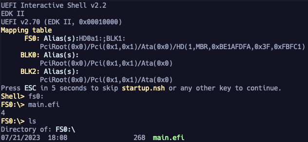
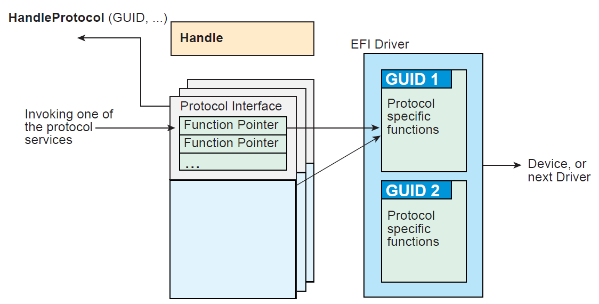
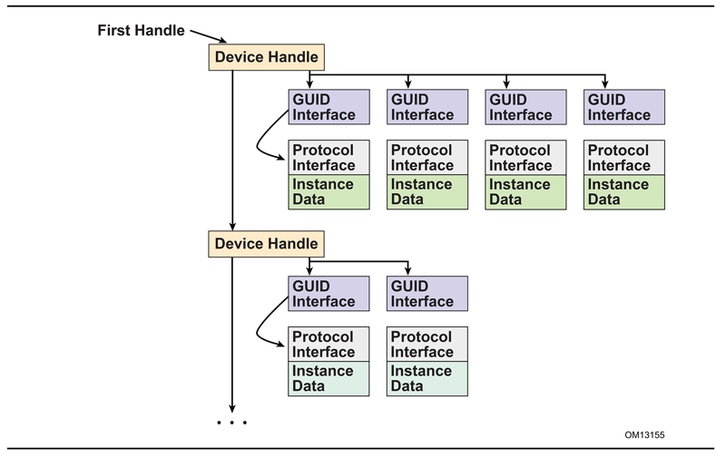
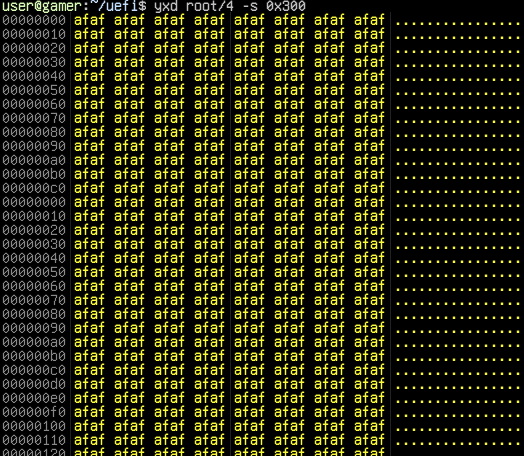
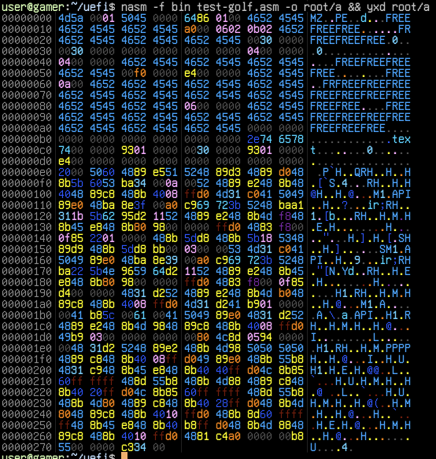
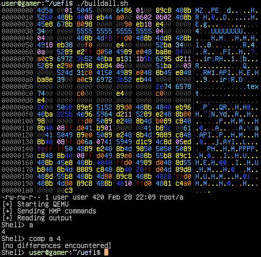

# BGGP4: A 420 Byte Self-Replicating UEFI App For x64

Hello hello, this writeup serves as an extremely late entry to the fourth annual [Binary Golf Grand Prix](https://github.com/binarygolf/bggp). The [challenge](https://binary.golf/) was to create the smallest self-replicating file that prints, returns, or displays the number 4. My entry is a 420 byte self-replicating UEFI app.

In this writeup, I will cover UEFI, the UEFI x64 ABI, writing UEFI applications in x86_64 assembly, Tianocore EDK2 image loader internals, QEMU automation, and binary golf strategies for UEFI PEs.

## Contents

- [Introduction](#Introduction)
- [Why Is UEFI?](#Why-Is-UEFI)
- [Getting Started](#Getting-Started)
- [Basic UEFI Application](#Basic-UEFI-Application)
- [Understanding the x64 UEFI ABI](#Understanding-the-x64-UEFI-ABI)
- [Printing 4 In Assembly](#Printing-4-In-Assembly)
- [Quick Note On Debugging](#Quick-Note-On-Debugging)
- [Self Replicating](#Self-Replicating)
  - [Wait WTH are protocols??](#Wait-WTH-are-protocols)
  - [Interacting with the Filesystem](#Interacting-with-the-Filesystem)
  - [Reading The File Into Memory](#Reading-The-File-Into-Memory)
  - [Writing Data To A New File](#Writing-Data-To-A-New-File)
    - [Using Five Arguments In A Call](#Using-Five-Arguments-In-A-Call)
    - [File Write](#File-Write)
- [How Does UEFI Load Images?](#How-Does-UEFI-Load-Images)
- [Golfing The Binary](#Golfing-The-Binary)
  - [TinyPE](#TinyPE)
  - [Creating A Testing Script](#Creating-A-Testing-Script)
  - [Exploring The Caves](#Exploring-The-Caves)
  - [jmp'ing around the header](#jmping-around-the-header)
  - [Types Of Optimizations I Did](#Types-Of-Optimizations-I-Did)
    - [Assuming Addresses Are 32 Bit](#Assuming-Addresses-Are-32-Bit)
    - [Storing Data In The Header](#Storing-Data-In-The-Header)
    - [Assuming RAX Is 0 After Calls](#Assuming-RAX-Is-0-After-Calls)
    - [Reusing Values In Registers](#Reusing-Values-In-Registers)
  - [Finishing Touches](#Finishing-Touches)
  - [Future Optimizations](#Future-Optimizations)
- [Conclusion](#Conclusion)

## Introduction

I was already playing with UEFI when this challenge began, trying to understand services and explore interesting features built into the spec. UEFI is one of those things that I always "knew about" but never really dove into outside of reading write ups and books. I've written some x86 bootloaders and [real mode](https://en.wikipedia.org/wiki/Real_mode) programs in the past, such as [MBR](https://en.wikipedia.org/wiki/Master_boot_record) infectors and toy bootkits, but I had never tried to write anything for UEFI directly. 

I actually didn't even have a computer that used UEFI to play with until fairly recently. I used to use an old Dell laptop from the mid 00s, and I could load my disk images off a legit floppy and boot into them on real hardware. Now that pretty much every PC I have uses UEFI, I figured it was time to learn.

Let's go over some of the stone cold facts about UEFI.

## Why Is UEFI?


[UEFI](https://en.wikipedia.org/wiki/UEFI) or (Unified Extensible Firmware Interface) is a type of firmware that creates a consistent interface to setup and manage devices (such as disks and hardware peripherals) that are needed for your operating system to boot. 

It was developed as a replacement for traditional [BIOS](https://en.wikipedia.org/wiki/BIOS), to provide a unified set of APIs that abstract away a bunch of ancient constraints and programming requirements that are tedious to deal with manually.



_BIOS King_

What are these constraints and requirements you ask? They are things like needing to enable the [A20 line](https://en.wikipedia.org/wiki/A20_line) to access all the memory for addressing in real mode (the mode your processor is in when it first turns on). This allowed you to store more things in memory like your bootloader or OS Image. You also had to do all the hardware initialization yourself, and simple things like disk reads (using [Cylinder-head-sector](https://en.wikipedia.org/wiki/Cylinder-head-sector)) were very laborious.



_...they have played us for absolute fools_

The whole BIOS workflow was arduous, error prone, and problems were difficult to diagnose. On top of that you have to use the same BIOS interrupts the pioneers used to use. Peace be upon Ralf Brown's [INTERRUP.LST](https://en.wikipedia.org/wiki/Ralf_Brown%27s_Interrupt_List)

Since old school BIOS was clunky and annoying, a bunch of manufacturers teamed up to make [SMBIOS](https://en.wikipedia.org/wiki/System_Management_BIOS).  This was originally known as DMIBIOS, because it interacted with a thing called Desktop Management Interface or [DMI](https://en.wikipedia.org/wiki/Desktop_Management_Interface). SMBIOS provides a bunch of data structures (sometimes called "tables" or "records") that contain information about the platform's components or features.

> Fun Fact: The original MS-DOS BIOS, known as IO.SYS, was named after famed Touhou Doujin circle [IOSYS](https://www.youtube.com/watch?v=1pDM6fQUfJs) /s

If you want to play with a BIOS implementation, you can use SeaBIOS with QEMU:

```sh
git clone https://github.com/coreboot/seabios && cd seabios && make
qemu-system-x86_64 -bios out/bios.bin -nographic
```

Instead of booting a single bootloader like traditional BIOS, UEFI allows you to run Applications and Drivers. These applications can do various setup and verification tasks, as well as gather information about the state of the current hardware using well defined structures. After all this is set up, it passes to the boot code for your operating system, which boots the OS.



_UEFI Spec 2.: Fig 2.1 Booting Sequence_

UEFI abstracts the low level interface by taking all of the key BIOS features and turning them to APIs and a well defined environment that makes creating reliable firmware easier. UEFI exposes the core functionality as "Services" and "Protocols", which are used to interact with the UEFI runtime and underlying hardware. UEFI is also useful from an operating system perspective, because you still need to interact with the hardware, and UEFI drivers can make it easier to do that.

UEFI is just a spec, and it's not meant to be tied to any programming language or architecture. The most well known UEFI implementation is [Tianocore EDK2](https://en.wikipedia.org/wiki/TianoCore_EDK_II), which contains a vast library of code and compatibility layers for a large number of targets.

EDK2 repo: https://github.com/tianocore/edk2

## Getting Started

Before this challenge began, I was originally looking to write a small demonstration payload for the [tiny Linux Kernel Module](https://tmpout.sh/3/19.html) that rqu and I wrote for tmp.0ut Volume 3. We had been curious about UEFI from a Linux perspective, and were looking for a simple way to build and test small apps.

My go-to place for no-nonsense low level tutorials has been the OS Dev Wiki, and they had an article called [UEFI App Bare Bones](https://wiki.osdev.org/UEFI_App_Bare_Bones). This seemed like a good place to start, and it was using [gnu-efi](https://wiki.osdev.org/GNU-EFI), which allows you to build UEFI apps using gcc on Linux. 

gnu-efi repo: https://sourceforge.net/p/gnu-efi/code/ci/master/tree/

I won't recommend gnu-efi for anyone getting started with UEFI programming, as it's far more ropey than EDK2. It was helpful for reasons I will discuss in this writeup, but most tutorials and code examples you will see for UEFI will be from EDK2. This repo called [UEFI-Lessons](https://github.com/Kostr/UEFI-Lessons) is a much better starting point for anyone who wants to use the EDK2 codebase.

Another good guide for getting started:
- https://krinkinmu.github.io/2020/10/11/efi-getting-started.html

## Basic UEFI Application

I built a basic application with gnu-efi based on the UEFI App Bare Bones tutorial on OS Dev. It displays a message and waits for a keypress, then it prints information about the keypress and exits. I used QEMU to run it.

```shell
/usr/bin/qemu-system-x86_64 \
  -drive if=pflash,format=raw,file=./OVMF.fd \
  -drive format=raw,file=fat:rw:./root \
  -net none \
  -nographic
```

This is what the code looks like:
```c
#include <efi.h>
#include <efilib.h>

EFI_STATUS
efi_main (EFI_HANDLE image, EFI_SYSTEM_TABLE *systab)
{
    EFI_INPUT_KEY efi_input_key;
    EFI_STATUS efi_status;

    InitializeLib(image, systab);
    Print(L"    (0w0)/ (^V^)/ (@.@)/    \n");
    Print(L"   Your boys just want to   \n");
    Print(L" dap you up before you boot.\n");
    Print(L"\n\n");
    Print(L"    Press any key to dap.\n");
    WaitForSingleEvent(ST->ConIn->WaitForKey, 0);
    uefi_call_wrapper(ST->ConOut->OutputString, 2, ST->ConOut, L"\n\n");

    efi_status = uefi_call_wrapper(ST->ConIn->ReadKeyStroke, 2, ST->ConIn, &efi_input_key);

    Print(L"You dapped: ScanCode [%02xh] UnicodeChar [%02xh] CallRtStatus [%02xh]\n",
        efi_input_key.ScanCode, efi_input_key.UnicodeChar, efi_status);

    return EFI_SUCCESS;
}
```

Every UEFI application starts with `efi_main`. This is the main function of the program, with the `EFI_HANDLE` and the `EFI_SYSTEM_TABLE` passed as arguments.

The [System Table](https://uefi.org/specs/UEFI/2.10/04_EFI_System_Table.html) (referred to as `ST` in this program) is an important structure that provides pointers to services you can call. The `uefi_call_wrapper` is just a way you can call these functions directly that is specific to this gnu-efi implementation. In EDK2, there are functions defined for these calls to make it a bit less clunky to use and provide some checks for the programmer. 

To be honest, I liked how hacky this all was in gnu-efi, because it was easier to study than trying to look it all up in the EDK2 source.

Okay, let's take a look at how [OutputString](https://uefi.org/specs/UEFI/2.10/12_Protocols_Console_Support.html#efi-simple-text-output-protocol-outputstring) is called via `uefi_call_wrapper`.
```c
    uefi_call_wrapper(ST->ConOut->OutputString, 2, ST->ConOut, L"\n\n");
```

- The first argument is a function pointer to the OutputString function of ConOut, which is stored in the System Table (ST).
- The second argument is the number of arguments in this call. 
- The rest of the arguments are arguments to OutputString, which are `ST->ConOut` and two new lines.

This is the function prototype of OutputString, which has two arguments that match what we are seeing the in the code.
```c
(EFIAPI *EFI_TEXT_STRING) (
 IN EFI_SIMPLE_TEXT_OUTPUT_PROTOCOL    *This,
 IN CHAR16                             *String
 );
```

Great! This shows us that if we want to golf this application, there are structures that can be traversed in order to find the functions we are looking for. This will help to avoid linking and symbols and everything that can make a binary extremely clunky.

Alright, so now we know how to build a basic app and call functions, how can we write it in assembly?

## Understanding the x64 UEFI ABI

The UEFI firmware is the running program that we can interact with that can load our application. You can talk it using the UEFI shell. This shell provides a very basic set of tools to run applications, examine memory, query and set up peripherals and drivers, and other utilities. 

The UEFI firmware I am using to test my applications is [OVMF](https://github.com/tianocore/tianocore.github.io/wiki/OVMF), which is the Open VM Firmware from EDK2 that is built to run in a virtual machine environment like QEMU.

At the `Shell>` prompt in OVMF, you can type `fs0:` to get to the first filesystem, which should be mapped to your `root/` folder. Then you can see files using the `dir` command. The UEFI shell has a lot of interesting features and builtin commands. Type `help` to see a full list. They even have a cute lil hex editor built right in.

OVMF implements the UEFI [ABI](https://en.wikipedia.org/wiki/Application_binary_interface), which is a set of rules that are assumed to be followed by applications in a given environment. These rules dictate things like what registers are used as arguments to a function, which registers are considered volatile between function calls, how the stack should be aligned, and who takes care of cleanup. Normally this information is abstracted from developers by the compiler, but it's required information for programming in assembly.

Even though the `uefi_call_wrapper` is a fairly low level call, it still doesn't show us what the ABI is. It's here that I started combing the docs for information, and comparing to what I saw when I opened my application in Ghidra. The glue code that supports `uefi_call_wrapper` is defined in `inc/x86_64/efi_bind.h` in the gnu-efi source.

Two important things to know are the Handoff State and Calling Conventions.

The [x64 Handoff State](https://uefi.org/specs/UEFI/2.10/02_Overview.html#handoff-state-2) is described in 2.3.4.1 in the spec. This describes the register state when an application first states, AKA when control is passed to `efi_main()`

| register | contents           |
| -------- | ------------------ |
| rcx      | EFI_HANDLE         |
| rdx      | EFI_SYSTEM_TABLE*  |
| rsp      | \[return address\] |

The [Calling Convention](https://uefi.org/specs/UEFI/2.10/02_Overview.html#detailed-calling-conventions) is defined in 2.3.4.2 in the spec. This is what registers represent arguments to a function.

| Argument | Register | Note         |
| -------- | -------- | ------------ |
| 1st      | rcx      |              |
| 2nd      | rdx      |              |
| 3rd      | r8       |              |
| 4th      | r9       |              |
| 5th      | Stack    |              |
| -        | rax      | Return value |

If you want to know more about the UEFI programming environment, check out [Section 2: Overview](https://uefi.org/specs/UEFI/2.10/02_Overview.html). All of the info for [x64 platforms](https://uefi.org/specs/UEFI/2.10/02_Overview.html#x64-platforms) is in 2.3.4.

Armed with this information, we can start writing some assembly!

> ic3qu33n found this repo that has UEFI programs built with nasm. I didn't see these when I wrote this, but the examples may be useful if you're trying to write UEFI programs in assembly: 
> https://github.com/BrianOtto/nasm-uefi

## Printing 4 In Assembly

One of the BGGP4 challenge requirements is that the application needs to return, print, or otherwise display the number 4. Since the example app prints something, I figured we could try to reimplement that functionality in assembly. I'll explain the process of finding the smallest PE header that would work on UEFI later, but for now, know that I can generate small PEs to test.

This is a very basic implementation of calling `OutputString()` in UEFI. The way that this code is structured is similar to how a lot of the code in the final app will be. I'll walk through this implementation as a way to introduce the ABI and how to use it to write code in assembly.

```asm
EFI_SYSTEM_TABLE_ConOut                     equ 0x40
EFI_SYSTEM_TABLE_ConOut_OutputString        equ 0x08
EFI_SYSTEM_TABLE_BootServices               equ 0x60

cStart:
  mov  rbp, rsp 
  push rcx       ; [rbp+0x08] ImageHandle
  push rdx       ; [rbp+0x10] SystemTable

print4:
; https://uefi.org/specs/UEFI/2.10/12_Protocols_Console_Support.html#efi-simple-text-output-protocol-outputstring
; (EFIAPI *EFI_TEXT_STRING) (
;  IN EFI_SIMPLE_TEXT_OUTPUT_PROTOCOL    *This, // rcx
;  IN CHAR16                             *String // rdx
;  );

  mov  rax, rdx  ; rax = SystemTable

  mov  rdx, 0xa0034 ; rdx = String "4\n"
  push rdx          ; [rbp+0x18] String "4\n"
  mov  rdx, rsp     ; rdx = *String

  mov  rcx, [rax+EFI_SYSTEM_TABLE_ConOut] ; rcx = *This // The output file descriptor

  mov  rax, rcx
  mov  rax, [rax+EFI_SYSTEM_TABLE_ConOut_OutputString]
  call rax ; Call SystemTable->ConOut->OutputString()

bail:
  sub rsp, 0x18
  ret
```

The first three lines of this code are function offsets that are defined as constants to make the code a bit more readable. I got these offsets by examining the size of the structs we need to process, and comparing to what was in Ghidra when the call was actually made.

The `cStart` label is the start of the code. Since we know that the Handoff State puts useful data in rcx and rdx at the start of the program, we can push those on the stack because we will need them later on. The function we want to call is `SystemTable->ConOut->OutputString()`. This means we need to navigate the System Table to get the address OutputString so we can call it.

This is what the System Table looks like:
```c
typedef struct {
  EFI_TABLE_HEADER                 Hdr;
  CHAR16                           *FirmwareVendor;
  UINT32                           FirmwareRevision;
  EFI_HANDLE                       ConsoleInHandle;
  EFI_SIMPLE_TEXT_INPUT_PROTOCOL   *ConIn;
  EFI_HANDLE                       ConsoleOutHandle;
  EFI_SIMPLE_TEXT_OUTPUT_PROTOCOL  *ConOut; // <-- We want this!
  EFI_HANDLE                       StandardErrorHandle;
  EFI_SIMPLE_TEXT_OUTPUT_PROTOCOL  *StdErr;
  EFI_RUNTIME_SERVICES             *RuntimeServices;
  EFI_BOOT_SERVICES                *BootServices;
  UINTN                            NumberOfTableEntries;
  EFI_CONFIGURATION_TABLE          *ConfigurationTable;
} EFI_SYSTEM_TABLE;
```

ConOut is a [EFI_SIMPLE_TEXT_OUTPUT_PROTOCOL](https://uefi.org/specs/UEFI/2.10/12_Protocols_Console_Support.html#efi-simple-text-output-protocol) type, which looks like this:
```c
typedef struct _EFI_SIMPLE_TEXT_OUTPUT_PROTOCOL {
 EFI_TEXT_RESET                    Reset;
 EFI_TEXT_STRING                   OutputString; // <-- We want this!
 EFI_TEXT_TEST_STRING              TestString;
 EFI_TEXT_QUERY_MODE               QueryMode;
 EFI_TEXT_SET_MODE                 SetMode;
 EFI_TEXT_SET_ATTRIBUTE            SetAttribute;
 EFI_TEXT_CLEAR_SCREEN             ClearScreen;
 EFI_TEXT_SET_CURSOR_POSITION      SetCursorPosition;
 EFI_TEXT_ENABLE_CURSOR            EnableCursor;
 SIMPLE_TEXT_OUTPUT_MODE           *Mode;
} EFI_SIMPLE_TEXT_OUTPUT_PROTOCOL;
```

This is the prototype for [OutputString](https://uefi.org/specs/UEFI/2.10/12_Protocols_Console_Support.html#efi-simple-text-output-protocol-outputstring) again, with the registers that these arguments are tied to.
```c
 (EFIAPI *EFI_TEXT_STRING) (
  IN EFI_SIMPLE_TEXT_OUTPUT_PROTOCOL    *This, // rcx
  IN CHAR16                             *String // rdx
  );
```

`ConOut` is both the handle to the console's text output, and contains functions for acting on it. I grabbed the SystemTable from rdx and put it in rax, then got the address of `ConOut` and put it in rcx. Then I copied it back to rax and got the address of `OutputString()`. Before calling, there needs to be a pointer to the string we want to print in rdx. I used the stack to push `"4\n"` and then move rsp into rdx to get the address of this string.

> Note: UEFI uses [UTF-16](https://en.wikipedia.org/wiki/UTF-16) for strings and filenames. In practice, this just means you need to add 00s between normal ASCII characters and end your string with two NULL bytes, instead of just 1.

Okay sick, does it work?



Yes! Sweet, now that we know how to set up and call functions, lets try to implement more of them in assembly! 

## Quick Note On Debugging

UEFI has various debugging features built in. The documentation can be a little confusing, because there are many different debugging situations described. If you are using EDK2, there is good documentation on how to use [gdb for debugging](https://github.com/tianocore/tianocore.github.io/wiki/How-to-debug-OVMF-with-QEMU-using-GDB).

The OS Dev wiki has some info on [debugging with gdb](https://wiki.osdev.org/Debugging_UEFI_applications_with_GDB) as well.

To enable gdb debugging with QEMU, you need the `-s` flag in your command line arguments to QEMU:
```sh
/usr/bin/qemu-system-x86_64 \
  -drive if=pflash,format=raw,file=./OVMF.fd \
  -drive format=raw,file=fat:rw:./root \
  -net none \
  -nographic \
  -s
```

Then you can start debugging using gdb.
```shell
gdb root/example.efi
...
(gdb) target remote :1234
```

When I started working on my assembly UEFI app, I had trouble debugging it with gdb. I had originally been using the gdb extension [gef](https://github.com/hugsy/gef), but support for UEFI, especially handcrafted apps, is not really all there yet. Only once I started using vanilla gdb was I able to remotely debug in QEMU.

One of the issues that made it even more frustrating to debug was that I kept getting weird crashes that I believe were the result of my original tests, which possibly corrupted my OVMF image. After restoring to a known good OVMF.fd file, things started working again. I included this [OVMF.fd](OVMF.fd) file in the repo.

You don't have to do this, but I added this to my `~/.gdbinit` file to enable running multiple commands on each line using gdb:
```python
# multiple commands
python
from __future__ import print_function
import gdb


class Cmds(gdb.Command):
  """run multiple commands separated by ';'"""
  def __init__(self):
    gdb.Command.__init__(
      self,
      "cmds",
      gdb.COMMAND_DATA,
      gdb.COMPLETE_SYMBOL,
      True,
    )

  def invoke(self, arg, from_tty):
    for fragment in arg.split(';'):
      # from_tty is passed in from invoke.
      # These commands should be considered interactive if the command
      # that invoked them is interactive.
      # to_string is false. We just want to write the output of the commands, not capture it.
      gdb.execute(fragment, from_tty=from_tty, to_string=False)
      print()

Cmds()
end
```

This let me create oneliners of commands separated by semicolons that I could paste or use in scripts that was a bit easier to manage

Example:
```
cmds stepi; echo \[CODE\]\n ; x/3i $rip ; echo \[REGS\]\n ; i r rax rbx rcx rdx rsi rdi rbp rsp r8 r9 r10 r11 r12 r13 r14 r15 rip eflags; echo \[STACK\]\n ; x/20gx $sp
```

There are definitely other ways to do this, but this was a little workaround that was good enough for my purposes.

## Self Replicating


Now that debugging was set up, it was time to understand how to do self-replication from a UEFI perspective.

When writing self replicating code for an operating system, there are usually system functions that can help you work with the filesystem to open and copy files. Since UEFI is operating below the OS level, there are some extra things that need to be done, but otherwise the filesystem functionality is similar to many others. 

These are the things you generally need to do to copy a file on a given filesystem:
- Open the original file
- Open a new file
- Write the contents of the original file to the new file
- Close both files

The key difference for doing this on UEFI is that the filesystem needs to be located first, and then opened and accessed via an handle. It's similar to needing to mount a disk before you start interacting with files on it.

To see how others did this, I started by looking at some examples I had found of people doing FileIO tests. This one in particular had the most examples: https://github.com/zhenghuadai/uefi-programming/blob/master/book/FileIo/TestFileIo.c

While examing this code, I took inventory of the UEFI calls it was doing. All I really needed at this point were the types and the function names, and then I could write with assembly from the spec directly.

I saw that their program had a function called `GetFileIo()` which passed a pointer to an [EFI_FILE_PROTOCOL](https://uefi.org/specs/UEFI/2.10/13_Protocols_Media_Access.html#file-protocol) type variable named Root. This variable represents the filesystem root, and is opened by the call to `OpenVolume()`.

```c
EFI_STATUS 
GetFileIo( EFI_FILE_PROTOCOL** Root)
{
  EFI_STATUS  Status = 0;
    EFI_SIMPLE_FILE_SYSTEM_PROTOCOL *SimpleFileSystem;
    Status = gBS->LocateProtocol(
            &gEfiSimpleFileSystemProtocolGuid,
            NULL,
            (VOID**)&SimpleFileSystem
    );
    if (EFI_ERROR(Status)) {
     //未找到EFI_SIMPLE_FILE_SYSTEM_PROTOCOL
        return Status;
    }
    Status = SimpleFileSystem->OpenVolume(SimpleFileSystem, Root);
    return Status;
}
```

The code uses the [SimpleFileSystem protocol](https://uefi.org/specs/UEFI/2.10/13_Protocols_Media_Access.html#simple-file-system-protocol) to get a pointer to a structure that has the OpenVolume function we need. OpenVolume is then called on the Root pointer which populates this with the address of the Filesystem Root handle.

### Wait WTH are protocols??

[Protocols](https://uefi.org/specs/UEFI/2.10/02_Overview.html#protocols) are basically just collections of services that a specific devices support. They are referenced with a GUID.



Each device has their own set of protocols. These can be accessed through a number of functions, and you can even install your own [protocol handlers](https://uefi.org/specs/UEFI/2.10/07_Services_Boot_Services.html#protocol-handler-services) to a device if you want.



[HandleProtocol](https://uefi.org/specs/UEFI/2.10/07_Services_Boot_Services.html#efi-boot-services-handleprotocol) takes argument of a GUID that represents the protocol. In return, it gives you a pointer to a list of functions related to that protocol that you can reference and use.

The technique that used in my code uses `HandleProtocol()` instead of `LocateProtocol()`. I saw HandleProtocol in other code I had already built, so I decided to use that instead of trying to set up a call to LocateProtocol. 

The docs themselves state that you should use [OpenProtocol](https://uefi.org/specs/UEFI/2.10/07_Services_Boot_Services.html#efi-boot-services-openprotocol) instead of HandleProtocol, but it looked more complicated and I didn't want to get off track implementing this behavior.

### Interacting with the Filesystem

This is the prototype for [HandleProtocol](https://uefi.org/specs/UEFI/2.10/07_Services_Boot_Services.html#efi-boot-services-handleprotocol). Before the type in the arguments are either IN or OUT. IN is an input parameter, and OUT is a parameter that will be modified by the function you are calling. 
```c
(EFIAPI *EFI_HANDLE_PROTOCOL) (
   IN EFI_HANDLE                    Handle,     // rcx
   IN EFI_GUID                      *Protocol,  // rdx
   OUT VOID                         **Interface // r8
   );
```

I wrote an implementation that makes this call to HandleProtocol to get a file system interface based on the documentation and referencing some compiled code. This just sets up the [SimpleFileSystem Protocol GUID](https://github.com/tianocore/edk2/blob/master/MdePkg/Include/Protocol/SimpleFileSystem.h#L18) and a pointer to the resulting interface, and then calls HandleProtocol.

```asm
handleSimpleFileSystemProtocol:
; Calling this to get a file system interface
  xor  r8, r8  ; r8 = SimpleFileSystemProtocolInterface
  push r8      ; [rbp-0x50] SimpleFileSystemProtocolInterface
  mov  r8, rsp ; r8 = *SimpleFileSystemProtocolInterface

  mov  rdx, 0x3b7269c9a000398e 
  push rdx       ; [rbp-0x58] gEfiSimpleFileSystemProtocolGuid
  mov  rdx, 0x11d26459964e5b22 
  push rdx       ; [rbp-0x60] gEfiSimpleFileSystemProtocolGuid
  mov  rdx, rsp  ; rdx = *gEfiSimpleFileSystemProtocolGuid

  ; Note that rcx is already set from earlier code

  mov  rax, [rbp-EFI_SYSTEM_TABLE_BootServices_o] 
  mov  rax, [rax+EFI_BOOT_SERVICES_HandleProtocol] 
  call rax  ; Call EFI_BOOT_SERVICES::HandleProtocol()
```

Now that there is a file system interface in rdx, we can try to open the file we want to copy. Looking back at the TestFileIo.c file, the `TestRead()` function shows ways of reading files from the Root pointer.

This snippet looks like generally what I need. It has flags to specify what mode to open the file in like other operating systems, and the arguments seem easy to set up. The only thing I need to really change here is that I don't need to create the file since it already exists. This code snippet comes from after a directory was opened, but the logic is the same on the file system root.

```c
        EFI_FILE_PROTOCOL *ReadMe = 0;
        Status = EfiDirectory ->Open(
                EfiDirectory,     // This (points to directory)
                &ReadMe,          // file handle
                (CHAR16*)L"readme.txt",  // filename
                EFI_FILE_MODE_CREATE | EFI_FILE_MODE_READ | EFI_FILE_MODE_WRITE, // mode
                0  // attributes
                );
        Status = ReadMe -> Close(ReadMe);
```

This is the [Open](https://uefi.org/specs/UEFI/2.10/13_Protocols_Media_Access.html#efi-file-protocol-open) function prototype:
```c
(EFIAPI *EFI_FILE_OPEN) (
  IN EFI_FILE_PROTOCOL                  *This, // rcx
  OUT EFI_FILE_PROTOCOL                 **NewHandle, // rdx
  IN CHAR16                             *FileName, // r8
  IN UINT64                             OpenMode, // r9
  IN UINT64                             Attributes // Stack
  );
```

The OpenMode and Attributes flags are defined [here](https://github.com/tianocore/edk2/blob/master/MdePkg/Include/Protocol/SimpleFileSystem.h#L124)

The resulting implementation looks like this in assembly. Since we aren't creating a file, it doesn't need the Attributes argument.
```asm
OpenOriginalFile:
  mov  r9, 1        ; rax = OpenMode

  mov  r8, 0x61005c ; "\a" - Our file name
  push r8           ; [rbp-0x70] CurrentFileName
  mov  r8, rsp      ; R8 = *CurrentFileName

  xor  rdx, rdx     ; rdx = 0
  push rdx          ; [rbp-0x78] OriginalFileHandle
  mov  rdx, rsp     ; rdx = **NewHandle

  mov  rcx, [rbp-DeviceFSRoot_o] ; rcx = EFI_FILE_PROTOCOL::Root

  mov  rax, rcx
  mov  rax, [rax+EFI_FILE_PROTOCOL_Open] ; rax = EFI_FILE_PROTOCOL::Open
  call rax
```

I got both FileOpen and FileClose working for the original file. Now I need to read it somewhere into memory to copy to the new file.

### Reading The File Into Memory

Before you can write the file, you need to read it into memory. To do that, you need to first allocate some memory.

The BootServices functions to allocate memory are fairly straightforward. AllocatePool allocates a chunk of memory, and FreePool frees it after use.

[AllocatePool](https://uefi.org/specs/UEFI/2.10/07_Services_Boot_Services.html#efi-boot-services-allocatepool) prototype
```c
(EFIAPI  *EFI_ALLOCATE_POOL) (
   IN EFI_MEMORY_TYPE            PoolType, // rcx
   IN UINTN                      Size, // rdx
   OUT VOID                      **Buffer // r8
   );
```

My implementation:
```asm
AllocatePool:
  mov  r8, rsp ; r8 = **Buffer
  mov  rdx, [rbp-ImageSize_o]
  xor  rcx, rcx ; EFI_MEMORY_TYPE PoolType = EfiReservedMemoryType
  mov  rax, [rbp-EFI_SYSTEM_TABLE_BootServices_o]
  mov  rax, [rax+EFI_BOOT_SERVICES_AllocatePool] 
  call rax  ; Call EFI_BOOT_SERVICES::AllocatePool()
```

[FreePool](https://uefi.org/specs/UEFI/2.9_A/07_Services_Boot_Services.html#efi-boot-services-freepool) prototype
```c
(EFIAPI *EFI_FREE_POOL) (
   IN VOID           *Buffer // rcx
   );
```

My implementation:
```asm
FreePool:
  mov  rcx, [rbp-AllocatePoolBuffer_o]
  mov  rax, [rbp-EFI_SYSTEM_TABLE_BootServices_o]
  mov  rax, [rax-EFI_BOOT_SERVICES_FreePool]
  call rax ; Call EFI_BOOT_SERVICES::FreePool()
```

To actually read the file contents into this chunk, you need to use the `EFI_FILE_READ` function

[Read](https://uefi.org/specs/UEFI/2.10/13_Protocols_Media_Access.html#efi-file-protocol-read) prototype:
```c
(EFIAPI *EFI_FILE_READ) (
  IN EFI_FILE_PROTOCOL           *This, // rcx 
  IN OUT UINTN                   *BufferSize, // rdx
  OUT VOID                       *Buffer // r8
  );
```

My implementation
```asm
ReadOriginalFile:
  mov  r8,  [rbp-AllocatePoolBuffer_o] ; r8 = *Buffer

  ;mov  rdx, [rbp-ImageSize_o] ; rdx = BufferSize ; This one didn't work!!
  lea  rdx, [rbp-ImageSize_o] ; rdx = *BufferSize

  mov  rcx, [rbp-OriginalFileHandle_o] ; rcx = *This

  mov  rax, rcx
  mov  rax, [rax+EFI_FILE_PROTOCOL_Read]
  call rax  ; Call EFI_FILE_PROTOCOL::Read()
```

To get the `BufferSize` variable that represents how much data you want to read, you need to get the size of the whole loaded image. Rather than trying to type it manually as the size of the image changes, it was easier to resolve it using the [LoadedImage Protocol](https://uefi.org/specs/UEFI/2.10/09_Protocols_EFI_Loaded_Image.html#id3). The way to access this protocol is the same as when we set up SimpleFileSystem Protocol, so I just reused the code and replaced it with the GUID for LoadedImage Protocol.

Something that I missed the first time around, is that the `BufferSize` is both an IN and an OUT in the prototype. From the docs:

```
On input, the size of the Buffer. On output, the amount
of data returned in Buffer. In both cases, the size is 
measured in bytes.
```

I had mistakenly thought `BufferSize` was just a value to pass to the function in rdx, but it actually needs to be a pointer because it's used as output. When you pass a value in rdx instead of a reference, the call to Read() still returns with a 0 in rax, indicating EFI_SUCCESS.

The docs say that this means that the data was read, but it doesn't actually mean that. The call will silently fail, and your buffer will point to uninitialized data instead. When I was originally working on this part, I didn't realize that my buffer was full of junk data. It was only when I tried to write it to a new image that I realized something was wrong, but it was hard to know where exactly my code had failed until I read the spec for every API I was calling and documented all the function prototypes for each.

### Writing Data To A New File

Now that we have a buffer containing the original file's data, we need to write it to the new file. The new file needs to be created using the `Open()` call, but with the `EFI_FILE_MODE_CREATE` flag set in the `OpenMode`. 

#### Using Five Arguments In A Call

If you call Open() with `EFI_FILE_MODE_CREATE`, you need to pass a fifth argument to the function. When you are using five arguments, the Calling Conventions say that the fifth argument needs to be on the stack. I had tried a few things to set the stack up properly, but I kept getting a Bad Parameter error from the Open call. I was wondering if it was an alignment issue or something else, but I couldn't find any references to how to arrange the stack for this.

I talked to ic3qu33n about this, and she told me that the stack needed to be 0x20 bytes. I implemented this and was excited to finally copy my file. It was here that I realized the the buffer was full of uninitialized memory, with the pattern `0xfa` over and over.



My `BufferSize` was a value and not a reference, so the Buffer that I tried to write was full of junk data. This confusion drove me insane for a bit, thinking that I had messed my handle up somewhere. It was only when I looked at the spec again in depth and realized that the BufferSize needed to be a pointer that it worked.

#### File Write

Now that the new file is open, we can write the buffer containing the original file's contents to the new file. You do that by doing calling [EFI_FILE_WRITE](https://uefi.org/specs/UEFI/2.10/13_Protocols_Media_Access.html#efi-file-protocol-write)
```c
(EFIAPI *EFI_FILE_WRITE) (
  IN EFI_FILE_PROTOCOL              *This, // rcx
  IN OUT UINTN                      *BufferSize, // rdx
  IN VOID                           *Buffer // r8
  );
```

This call was pretty straightforward to implement in assembly.
```asm
WriteNewFile:
  mov  r8,  [rbp-AllocatePoolBuffer_o] ; r8 = *Buffer
  lea  rdx, [rbp-ImageSize_o] ; rdx = *BufferSize
  mov  rcx, [rbp-NewFileHandle_o] ; rcx = *This
  mov  rax, rcx
  mov  rax, [rax+EFI_FILE_PROTOCOL_Write]
  call rax  ; Call EFI_FILE_PROTOCOL::Write()
```

Now that we have the file written, all we have to do is call [EFI_FILE_CLOSE](https://uefi.org/specs/UEFI/2.10/13_Protocols_Media_Access.html#efi-file-protocol-close)
```c
(EFIAPI *EFI_FILE_CLOSE) (
  IN EFI_FILE_PROTOCOL                     *This // rcx
  );
```

And that's it! Now that we have the logic down, let's start looking at the PE parser!

## How Does UEFI Load Images?

When you run an application, the UEFI firmware calls a Boot Service known as [LoadImage](https://uefi.org/specs/UEFI/2.10/07_Services_Boot_Services.html#efi-boot-services-loadimage). This function loads an EFI image into memory and returns a handle to that image. There are actually two types of binaries you can load using LoadImage: Portable Executables (PE) and Terse Executables. 

The [Terse Executable](https://uefi.org/specs/PI/1.8/V1_TE_Image.html) is a stripped down version of the PE, which was made for UEFI. This seemed like an interesting avenue to explore, but I decided to focus on the PE loader for this challenge and writeup because I wanted cover a deeper dive into [LoadImage and StartImage](https://github.com/tianocore-docs/edk2-UefiDriverWritersGuide/blob/master/5_uefi_services/52_services_that_uefi_drivers_rarely_use/524_loadimage_and_startimage.md) and experiments with TE in a later writeup. There are Kaitai structs for [TE files](https://formats.kaitai.io/uefi_te/index.html) if you're interested in exploring more.

Lets take a look at how LoadImage eventually gets to the PE and TE parser.
```
Call Stack:

BootServices // MdeModulePkg/Core/Dxe/DxeMain/DxeMain.c
  CoreLoadImage // MdeModulePkg/Core/Dxe/Image/Image.c
    CoreLoadImageCommon // MdeModulePkg/Core/Dxe/Image/Image.c
      CoreLoadPeImage // MdeModulePkg/Core/Dxe/Image/Image.c
        PeCoffLoaderGetImageInfo // MdePkg/Library/BasePeCoffLib/BasePeCoff.c
          PeCoffLoaderGetPeHeader // MdePkg/Library/BasePeCoffLib/BasePeCoff.c

There is another BasePeCoff.c with similar functions in BaseTools/Source/C/Common/, but it's not referenced here.
```

 The LoadImage boot service is referred to as `CoreLoadImage` in the codebase. It invokes a chain of functions that eventually lead to the parser logic, a function called `PeCoffLoaderGetPeHeader`. 

> I used [ctags](https://github.com/universal-ctags/ctags) in vim to navigate this codebase. It made it a lot easier to find the real definitions of functions and structures than even vscode or github. Thanks to xcellerator for putting me on to it.

When [PeCoffLoaderGetPeHeader](https://github.com/tianocore/edk2/blob/94c802e108a082d6f74c854bea8bd98fe7808453/MdePkg/Library/BasePeCoffLib/BasePeCoff.c#L46) is called, it checks the following things:
1. `OptionalHeader.NumberOfRvaAndSizes` - Needs to be correct
2. `FileHeader.SizeOfOptionalHeader` - Size needs to be correct
3. `FileHeader.NumberOfSections` - Number needs to match the number of section headers
4. `OptionalHeader.SizeOfHeaders` 
    1. Read last byte of `Hdr.Pe32.OptionalHeader.SizeOfHeaders` to confirm that the headers are the correct size
5. Check there are enough [Image Directory Entries](https://0xrick.github.io/win-internals/pe5/) to contain `EFI_IMAGE_DIRECTORY_ENTRY_SECURITY`

Looking at the code for step 5., we can see that it's checking if the NumberOfRvaAndSizes field is greater than [EFI_IMAGE_DIRECTORY_ENTRY_SECURITY](https://github.com/tianocore/edk2/blob/dc7cfa9bab7487aa0cec02d13aa8c34ff24b37a8/MdePkg/Include/IndustryStandard/PeImage.h#L127) which means that we need at least 6 Image Directories because the SECURITY entry is the 5th entry in the table.
```c
// Check the EFI_IMAGE_DIRECTORY_ENTRY_SECURITY data.
// Read the last byte to make sure the data is in the image region.
// The DataDirectory array begin with 1, not 0, so here use < to compare not <=.
//
if (EFI_IMAGE_DIRECTORY_ENTRY_SECURITY < Hdr.Pe32Plus->OptionalHeader.NumberOfRvaAndSizes) {
  if (Hdr.Pe32Plus->OptionalHeader.DataDirectory[EFI_IMAGE_DIRECTORY_ENTRY_SECURITY].Size != 0) {
```

Now that we know the logic to get the header past the parser checks, we can experiment. I wrote a goofy script [pe_filz.py](./old/pe_filz.py) to instrument my entire existing app and generate configurations of file header elements that would result in a binary that I could use to test. It's extremely hacky, but it worked. I was able to get the binary that just printed a string from 48KB down to 416 bytes.

The minimum viable PE header to load an application was 
- MZ Header
- PE Header
- Optional Header
- 6 data directories (All blank)
- A section header describing the .text section
- Code

## Golfing The Binary

_Realistic Golfing Action_

Now for the fun part, reducing the total size of the binary, by any means necessary.

### TinyPE

TinyPE is a technique for making a very small PE header, which reduces the size of the file and can also provide some obfuscation. I wrote about TinyPEs for x64 bit [here](https://n0.lol/a/pemangle.html), with info about why it works. I decided to test the [TinyPE template](https://github.com/netspooky/kimagure/blob/main/pe32template.asm) I made for a Windows shellcode tool I wrote called `kimagure`. This template was useful for generating small, reliable Windows binary payloads.

The trick that TinyPE relies on is setting the MZ header field `e_lfanew` to 0x04, which tells the loader that the PE header starts 4 bytes into the file. This overlays the PE header on the DOS header, without interfering with important values in either. The DOS header's `e_lfanew` overlaps with the PE header's `SectionAlignment`, which is valid for both. This logic is performed in `PeCoffLoaderGetPeHeader` [here](https://github.com/tianocore/edk2/blob/94c802e108a082d6f74c854bea8bd98fe7808453/MdePkg/Library/BasePeCoffLib/BasePeCoff.c#L103)

I had to change a few things about the existing TinyPE template I had, but since I already had the structure of the minimum viable UEFI app documented, it was easier than expected. I made sure to add the data directories and the section header I needed, and then my example code.

I built the code using nasm and put it in the root folder for OVMF.
```
nasm -f bin bggp4.uefi.asm -o root/a
```
I ran it, and it worked! 

If you're curious about more TinyPE explorations, check out:
- This [discussion](https://www.pouet.net/topic.php?which=9565) on pouet.net
- This [repo](https://github.com/ayaka14732/TinyPE-on-Win10) about creating TinyPEs for Windows 10

Also, UEFI has the same size limitation as 64 bit windows, which is 268 bytes. This is dictated by some sanity checks that calculate the expected size of certain header elements.

### Creating A Testing Script

Now in the phase of making rapid changes to test my binary, I needed a way to speed up the slow process of manually running and interacting with OVMF in QEMU. There is a 5 second countdown before you get to the shell, and you need to press enter to move past it.

During my early debugging adventures for UEFI, I explored the QEMU [HMP](https://qemu-project.gitlab.io/qemu/system/monitor.html) and [QMP](https://wiki.qemu.org/Documentation/QMP) protocols. HMP lets you run commands in the QEMU monitor that you can use to do things like start and stop the vm, inspect the state etc. The QMP protocol is similar, except it's a json API. 

I decided to instrument QEMU using a simple script that would build my code, do a hexdump using [yxd](https://github.com/netspooky/yxd), start qemu, and send commands over a TCP socket to the HMP monitor to execute the binary and then compare the original file with the newly created file. After running, the script would read the VM output from a log file and report to me. All told, this script took about 4.5 seconds to execute, which was good enough for me in practice. I had explored the idea of using or building a snapshot fuzzer, but it was ultimately overkill for what I was trying to do.

This script is called [test_app_qemu.py](./test_app_qemu.py) in this repo.

PROTIP: nasm can create a list of symbols in your assembly code by adding this to the top of your source. This will generate a file called `mybin.map`. This is super useful for debugging!
```
[map all mybin.map]
```

### Exploring The Caves

Knowing that there were only a few places that actually mattered in the loader, I could start confirming all the bytes in the header that were free to overwrite. I made a list of hot spots I wanted to explore based on what was already 0 in the header, and then started putting the pattern 0xAA55 wherever I could. Then I put the string "FREE" in all of those places to test with another value, and everything still worked as it should. This resulted in 116 bytes in the file header which were free for me to put code and data into.

This is a table of offsets that represents free areas in the header. 

| Start | End  | Size | Note                  |
| ----- | ---- | ---- | --------------------- |
| 0x0C  | 0x18 | 12   | FREE                  |
| 0x1E  | 0x2C | 14   | FREE                  |
| 0x34  | 0x3C | 8    | ImageBase - Is touchy |
| 0x44  | 0x54 | 16   | FREE                  |
| 0x5C  | 0x60 | 4    | FREE                  |
| 0x60  | 0x62 | 2    | Needs to be 0x0A :((  |
| 0x62  | 0x88 | 38   | FREE                  |
| 0x8C  | 0xAC | 32   | FREE                  |

The 8 byte ImageBase field in the header is actually used in the code, so you have to be careful about what you put in there if you decide to use it. There was also an annoying 2 byte field for the Subsystem that needed to be 0x0A.

This is what the binary looked like at this point.



To be able to jump back into the header, I had to make sure that the `.text` section containing the code was located directly after the header in memory. I adjusted the value of `AddressOfEntrypoint` in the PE header, and the virtual address in the section header to make this happen.

I also needed to confirm that the header didn't change in memory. Sometimes the header can be modified or destroyed in memory by the loading process, so it's not always a reliable place to store anything. In this case it was perfectly intact!

I dumped the header from memory to a file with this command in gdb:
```
(gdb) dump binary memory pe_header_in_memory.bin 0x6222000 0x62220E4
```

### jmp'ing Around The Header

Now I knew it was all working as expected, I started moving code up into the header. To do this, you need to know the actual size of the bytes for each instruction in your code. I used ndisasm to print out the disassembly for my binary so I could see the bytes for the instructions.
```shell
ndisasm -b 64 root/a
```

Now I can look at the total size of instructions and make sure that my assembler is doing the things I want it to do. Here's an example of the disassembly for the first 6 instructions of the code:
```
000000E4  89E5              mov ebp,esp
000000E6  51                push rcx
000000E7  52                push rdx
000000E8  89D3              mov ebx,edx
000000EA  89D0              mov eax,edx
000000EC  488B5B60          mov rbx,[rbx+0x60]
```

I started dividing my code up into little chunks that were the size of the header areas I could store code in. I had to account for the size of short jumps that will need to go at the end of each chunk. These are 2 byte instructions that can jump forward or backwards, but they can only jump a limited distance. The furthest number of bytes you can jump backwards is 125. It's really 127 bytes, but because it jumps from the next instruction's offset, you have to account for the two bytes of the instructions. 

Since the start offset is 0xE4, the furthest back you could jump from there is 0x69, because it's 127 bytes from offset 0xE6. This offset in the file falls in the range of a large block of free bytes toward the end of the header. I put a jump at a location that would allow me to jump further up into the header, without adding to the size of the code in the .text section due to larger instruction size for longer jump distances. I also put a jump before it while developing, so I could have a reliable path back into the main code. 

For more info on Short Jumps I refer you to my fav reference, The Starman's Realm [Using SHORT (Two-byte) Relative Jump Instructions](https://thestarman.pcministry.com/asm/2bytejumps.htm). I highly recommend you check that page out if you are interested in sizecoding on x86!!


_Super Metroid Space Jump_

Using this jump spot, I started carefully removing the header definitions and replacing them `nop` instructions. This gave me a canvas to start painting my code chunks on. I worked a few instructions at a time, making sure that the header code made it back to the main code. 

On each major change I did, I tested the output with my script, and confirmed that it all worked. Sometimes I could just tell I messed something up due to how the bytes were structured in the PE, and the fixes would usually involve adding or removing nops to put everything back where it goes.

Once I was satisfied with stuffing the header, I worked on optimizing the rest of the code.

### Types Of Optimizations I Did

Instead of going through everything, I wanted to just describe the different types of optimizations I applied to the code. Most of the code is just calling UEFI Services and Protocol functions, so many changes could be applied to each block of code.

#### Assuming Addresses Are 32 Bit

Although we are in 64 bit mode, the addresses used in OVMF are 32 bits. This means that doing register to register movs on the 32 bit form of each register was safe to do. 

By using the 32 bit registers, 1 byte can be saved per instruction.
```
0:  48 89 d3  mov rbx,rdx   ; 3 bytes
3:  89 d3     mov ebx,edx   ; 2 bytes!
```

Doing a register to register mov instruction will clear the top 32 bits of the register. This is okay for OVMF, but in other environments, you typically don't want to do this unless you're sure that no addresses will used more than 32 bits. When doing a `mov` on the the smaller forms of registers, only the 32 bit form will clear the top bits. For the 16 bit and 8 bit versions, it leaves the upper bits as is.

Table of how different register sizes affect `mov` in 64 bit mode. I cover this more in [i2ao](https://github.com/netspooky/i2ao/blob/master/txt/3.txt)
```asm
mov rbx, rdx ; Moves data to all 64 bits of rbx
mov ebx, edx ; Moves data to bottom 32 bits of rbx, clears top 32
mov bx, dx   ; Moves data to bottom 16 bits of rbx, doesn't touch the rest.
mov bl, bl   ; Moves data to bottom 8 bits of rbx, doesn't touch the rest.
```

I used my assembly REPL [scare](https://github.com/netspooky/scare) to emulate some instructions so I can confirm it does what I expect it to.

```
$ python3 -m pip install scare
$ scare -a x64
```

In the REPL, you can type `not rdx` to get a bunch of 0xFFs in rdx. Then play with the different sized movs to see how the registers are affected.


#### Storing Data In The Header

I tried to use the header as much as possible to store static values, but it wasn't always the best option. The header is fairly far from where most of the code is, so loading data from a relative address can result in code that is larger than what you're trying to optimize. This was the case for the large Attributes value in the call to Create on the new file. I ended up just doing an assembly optimization to make that smaller instead. (see the code)

I reused the PE headers `BaseOfCode` as the new file's name, which was conveniently a 4 byte field that is the exact size of a utf-16 "4".

#### Assuming RAX Is 0 After Calls

When you call a UEFI function, it usually returns the EFI_STATUS. The status EFI_SUCCESS is 0, which means the call succeeded. There were a lot of times where I needed a 0 on the stack, so I used rax as if it had a reliable 0. This allowed me to just `push rax` (1 byte) instead of having the xor another register (3 bytes) and then push.

#### Reusing Values In Registers

While debugging, I kept noticing that some registers already contained values I needed after calls. I put breakpoints after each UEFI call, and looked at what values were already there. I used this to remove relatively large stack references and replace them with smaller register to register `mov`s.

### Finishing Touches

At this point, I had beat my goal of getting under 512 bytes. I was at 469 bytes, looking at the end of the code to see where I could optimize. I wondered what would happen if I just didn't close the original file, or free the memory chunk I allocated. I found that it would still run, which meant I could pull both of those code blocks out. I was able to get it down to 440 bytes, before the final adjustment.

The last bit involved me rearranging the header a bit more and trying to fit more things in there. I was really annoyed by the Subsystem PE header field that needed to be 0x000A, because it separated a 4 byte free zone from a large 38 byte free zone.

I started to look for any instruction in the start of the code that could possibly reuse this by assembling to `0A 00` in some way. I remembered that my output string `"4\n"` has a 0x0A in it, followed by a null terminator (0x00).

```
53                push rbx
BA34000A00        mov edx,0xa0034
52                push rdx
89E2              mov edx,esp
```

There were only three bytes before `0A 00` in this instruction, so I could add one more byte to line it up perfectly. This worked because the instruction right before it was the one byte `push rbx`. This allowed me to move a bunch more code up into the header and get it down to a svelte 420 bytes.

At this point, I had a 420 byte self-replicating UEFI app, and I was satisfied.



The final code is in [bggp4.uefi.asm](./bggp4.uefi.asm)

### Future Optimizations

There are some optimizations that I wanted to apply, but I didn't because I thought a 420 byte self replicating UEFI app was funny enough. If you're up to a challenge, there are some relative offsets that could be adjusted, the stack could be used a bit better, and some code chunks could be reworked entirely.

## Conclusion

UEFI is a vast ecosystem, with many drivers and applications running on and endless number of devices. There is a lot of code in EDK2. It can be hard to find a good starting point, but once you find an approach that works you for, it starts to make sense. I hope that this writeup inspires you to play with the firmwares you rely on every day!

Special thanks go to icequeen, who was also working on UEFI, and who had already solved some of the annoying programming problems that I had faced. I also want to thank rqu and ackmage for looking at gnu-efi with me and doing the first babysteps towards understanding UEFI. Also big thanks to Ulf Frisk and ilove2pwn_ for listening to me ramble about this.

Shoutouts: The BGGP Community, Haunted Computer Club (slop), tmp.0ut

If you want to get involved in BGGP next year, or just hang out and share weird files you made, you're invited to join the [Discord](https://discord.gg/pGxSDfjMaF)!

Check out the other entries to BGGP4 [here](https://github.com/binarygolf/BGGP/tree/main/2023).

Here are some mixes on youtube that got me thru the tough times
- [NHÃ NHẠC VOL 5: CHIỀU CHỦ NHẬT Vinyl Mixset by Jazz Cát Lượng](https://www.youtube.com/watch?v=0fw2sC4MMM8)
- [DJ Eons - Sell Your Soul Part 1](https://www.youtube.com/watch?v=kYZPGBQS9yA) and [Part 2](https://www.youtube.com/watch?v=ofrTeTDmr2s)
- [SUPER★ANIME★REMIX SUPER★BEST / DISC 1](https://www.youtube.com/watch?v=B-qqaaIHGyg)
- [XCOPY - PT Weekender VII / Jungle Amiga Dj set](https://www.youtube.com/watch?v=VHPIxrcjKW4)
- [Bad Will b2b DJ XLAT - XMAS MEGA MIX](https://www.youtube.com/watch?v=YYbZ3PkiKt8)
- [The Brain That Wouldn't Die || Deep Dub DJ Mix || BASS BOOSTED](https://www.youtube.com/watch?v=cuQ6QmCNvfc)

If you want to see some more PEs I've done weird stuff with check out
- [Modern PE Mangling](https://n0.lol/a/pemangle.html) - Smallest possible PE that pops calc 
- [BGGP2021](https://github.com/binarygolf/BGGP/blob/main/2021/netspooky/ns.bggp2021.asm) - PE/JS/PDF polyglot that triggers a pop up of the number 2 in every way it's parsed.
- [BGGP2022](https://n0.lol/lemonade/) - LEMONADE.BIN - DOSing radare2 and rizin with [SOPHIE](https://www.youtube.com/watch?v=LdLvp630plc) lyrics. LE (related to PE) driver parser bug.

Lastly, here's another cool [writeup](https://xairy.io/articles/thinkpad-xdci) involving patching a UEFI app to unlock xDCI on a ThinkPad to allow it to act like a USB device.
